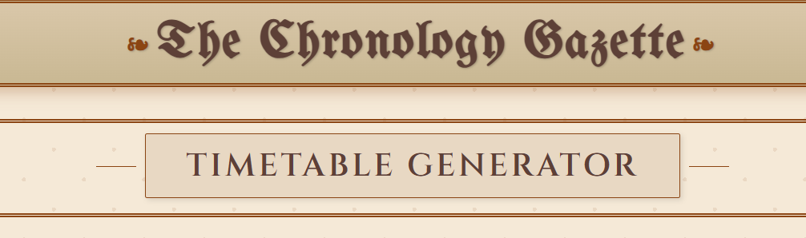

# NeuroSchedule AI




Automated, multi-agent timetable generator that produces optimized, conflict-free academic schedules in a publication-ready `Time × Days` CSV format. Built with CrewAI agents and Gemini LLM, NeuroSchedule AI automates subject allocation, enforces workload and institutional constraints, resolves faculty/room clashes, and exports clean timetables where each cell contains `Subject - Faculty - Room` or `Recess`.

---

## 🚀 Key Features

* **Multi-agent orchestration:** Modular agents (Preprocessor, SubjectAssigner, ConstraintModeler, ConflictResolver, Monitor, Ingestor) coordinated via CrewAI.
* **LLM-assisted reasoning:** Gemini LLM provides human-like scheduling heuristics and formatting assistance.
* **Constraint-aware scheduling:** Workload balancing, NEP-style constraints, and classroom/faculty availability enforcement.
* **Conflict detection & automatic resolution:** Avoids double-booking of teachers or rooms and suggests fixes.
* **Flexible inputs:** Accepts both *long* (Time, Day, Subject, Faculty, Room) and *wide* (Time + Day columns) CSVs.
* **Publication-ready export:** `Time, Monday, Tuesday, ..., Saturday` CSV with cells like `Subject - Faculty - Room` and `Recess`.
* **CLI & automation-friendly:** Scripts for headless runs, CrewAI orchestration, and optional Flask UI.

---

## 🔧 Tech Stack

* Python (Pandas)
* CrewAI (agent orchestration)
* Gemini LLM (LLM reasoning)
* Flask (optional web UI)
* Docker (optional containerization)

---

## ✅ Quick Start (local)

1. Clone the repo:

```bash
git clone https://github.com/<your-username>/neuroschedule-ai.git
cd neuroschedule-ai
```

2. Create & activate virtualenv, install deps:

```bash
python -m venv venv
source venv/bin/activate    # on Windows: venv\Scripts\activate
pip install -r requirements.txt
```

3. Prepare `data/sample_input_long.csv` using the sample format below.

4. Generate the timetable (CLI):

```bash
python scripts/generate_timetable.py --input data/sample_input_long.csv --output examples/sample_output_timetable.csv
```

5. Open `examples/sample_output_timetable.csv` in Excel / Google Sheets to view the formatted timetable.

---

## 📥 Input Formats

### Long form (recommended)

CSV columns: `Time, Day, Subject, Faculty, Room`

Example rows:

```
Time,Day,Subject,Faculty,Room
09:00-09:45,Monday,Computer,Dr. G,Room 107
09:00-09:45,Tuesday,Biology,Dr. E,Room 105
09:45-10:30,Monday,Math,Dr. A,Room 101
10:30-10:45,Monday,Recess,,
```

### Wide form (already pivoted)

CSV columns: `Time, Monday, Tuesday, Wednesday, Thursday, Friday, Saturday` with values already like `Subject - Faculty - Room` or `Recess`.

---

## 🛠 Script 

* Accepts either long or wide CSV inputs.
* Normalizes cell contents to `Subject - Faculty - Room` (keeps `Recess` unchanged).
* Pivots long-form input into a wide `Time × Days` layout.
* Joins multiple entries in a single cell with `/` (configurable).
* Writes final CSV ready for presentation or printing.

(See `scripts/generate_timetable.py` for full implementation.)

---

## 🧭 Running the full CrewAI pipeline

If you use CrewAI orchestration (recommended for automated subject assignment):

1. Place your base datasets in `data/` (subjects, faculty, classrooms, availability).
2. Configure your Gemini API key (e.g., export `GEMINI_API_KEY`).
3. Run the orchestration script:

```bash
python scripts/crew_run.py --sem sem1 --output examples/crew_output.csv
```

4. Post-process CrewAI output with the CLI formatter:

```bash
python scripts/generate_timetable.py --input examples/crew_output.csv --output examples/sample_output_timetable.csv
```

---

## 🖨 Presentation & Styling

For a polished, printable timetable (matching institutional aesthetics):

* Use the CSV output and an HTML/CSS template that styles the table (borders, header colors, typography).
* Optionally include a small script that converts the CSV into a styled HTML page and prints to PDF via headless Chromium.

---

## 🧪 Example Input & Output (short)

**Input (long sample):**

```
Time,Day,Subject,Faculty,Room
09:00-09:45,Monday,Computer,Dr. G,Room 107
09:00-09:45,Tuesday,Biology,Dr. E,Room 105
10:30-10:45,Monday,Recess,,
```

**Output (excerpt):**

```
Time,Monday,Tuesday,Wednesday,Thursday,Friday,Saturday
09:00-09:45,Computer - Dr. G - Room 107,Biology - Dr. E - Room 105,,,,
10:30-10:45,Recess,Recess,Recess,Recess,Recess,Recess
```

---

## 📝 Resume Blurb (copy-paste friendly)

**NeuroSchedule AI (CrewAI + Gemini LLM)**
– Built an optimized multi-agent timetable generator that automates subject allocation, enforces constraints, resolves faculty/room clashes, and exports publication-ready schedules.

---

## 🧾 Requirements (example `requirements.txt`)

```
pandas>=1.5
flask
crewai>=0.1
# gemini client or openai (depending on your LLM client)
```

## ✍️ Created By

Created by Dhruvil_Dave
Built with ❤️, logic, and neural precision.


